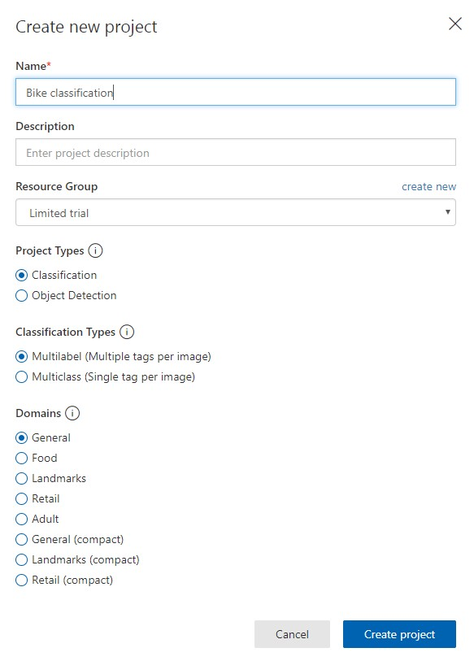
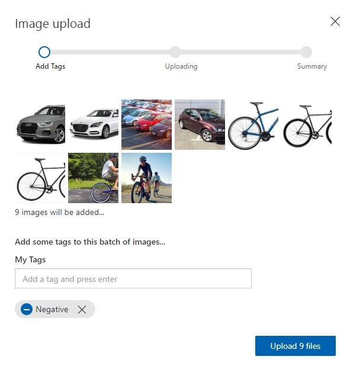
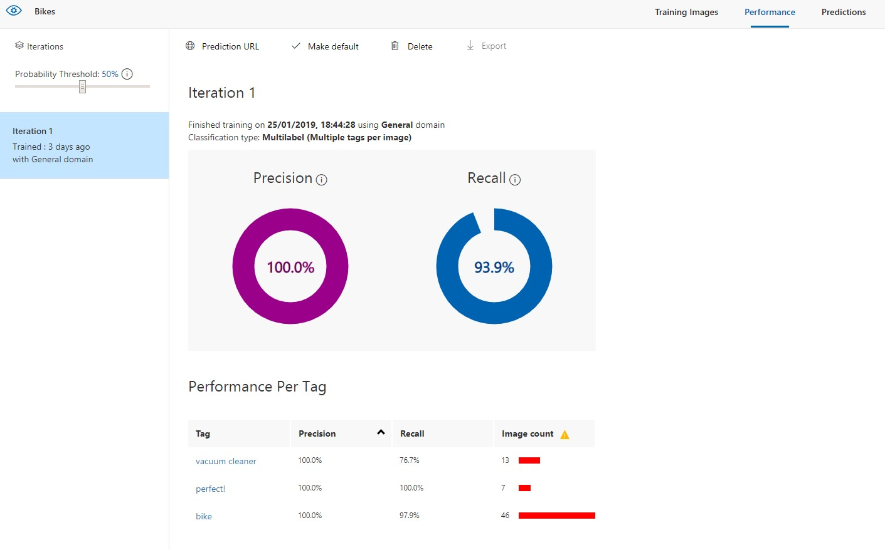
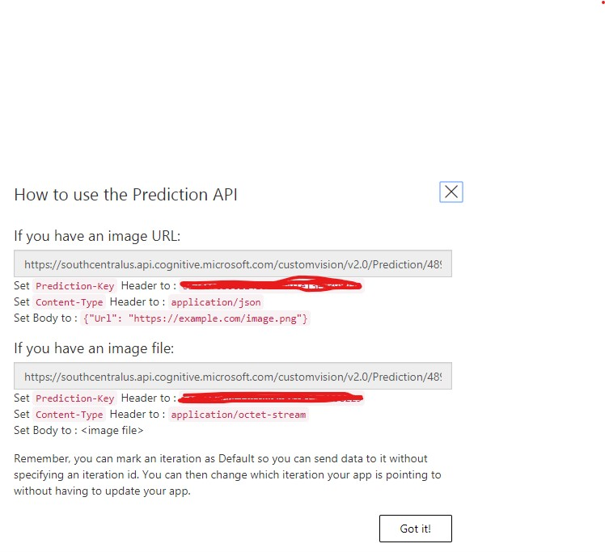
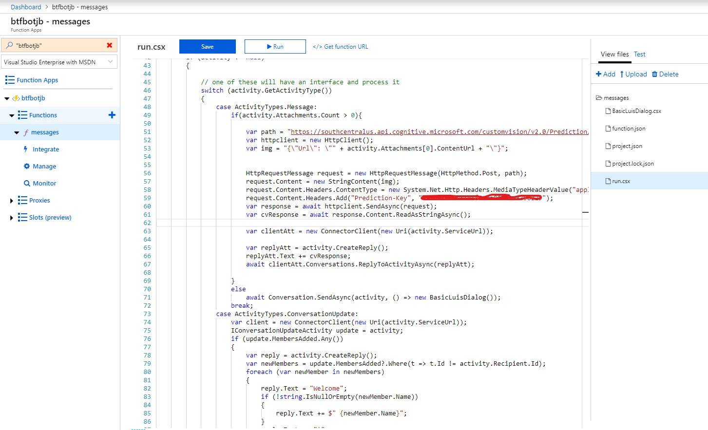

# Creating a custom vision
Lets go to [https://customvision.ai](https://customvision.ai)

Create a new project for bike classification

## Let's train it first
We'll have 4 tags:
- Negative - we always need negatives
- bike
- perfect!
- vacuum cleaner

We have different sets of images, one for each, upload for each tag

## after training, review performance

### and get the prediction URL

### Come back to the code and add the prediction url and keys to run.csx

Or copy paste the code from [here](exercises/ex3/run.csx)
