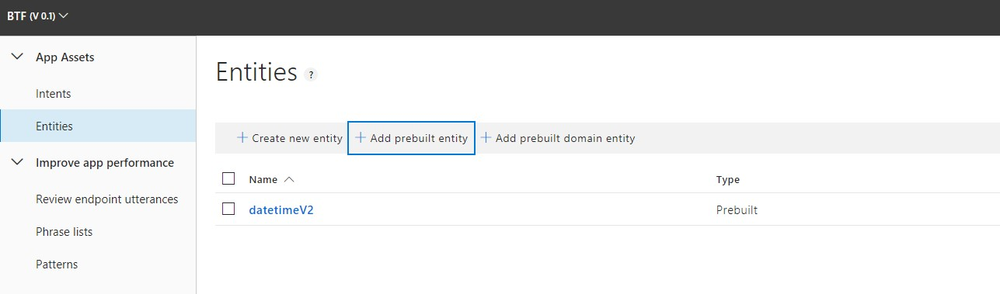
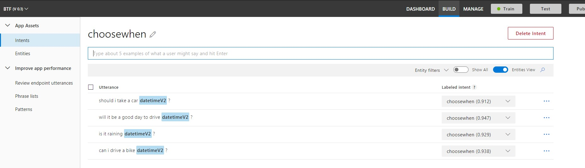
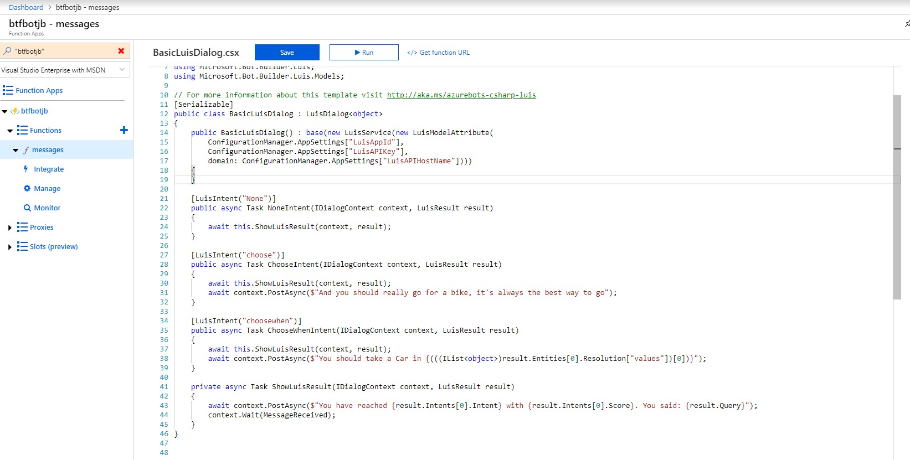

# Now for the intent choosewhen with datetime

## Let's add the prebuilt entity DateTime v2

Back in [LUIS](https://www.luis.ai), and our app, add a prebuilt entity - datetimev2

## Create the intent choosewhen
And let's start adding utterances:
* Can I drive a bike tomorrow?
* Is it raining today?
* Will it be a day to drive today?
* Should I take a car today?

### Train and publish again

Add the new intent to our bot:

Or just paste the code from here: [bot](exercises/ex2/BasicLuisDialog.csx)

here is how it works:
[datetime](https://docs.microsoft.com/en-us/azure/cognitive-services/luis/luis-reference-prebuilt-datetimev2)

## And let's train a custom vision
Let's see it [here](CustomVision.md)