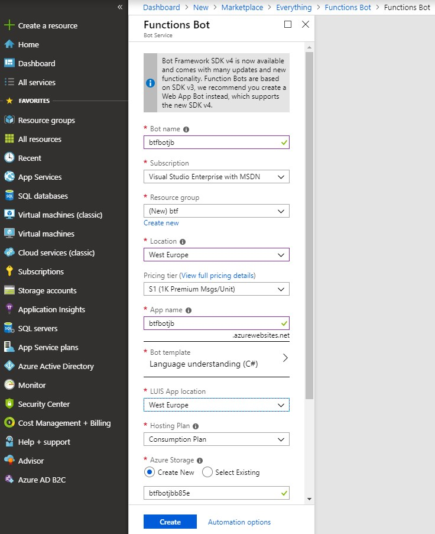

# CognitiveLab
Building the Future - Cognitive Lab

## Adding inteligence to a simple bot

# We're going to start with a simple bot and just start adding stuff to it - LUIS and Custom Vision

## We'll start preparing the bot

- First Create a function bot in [azure](https://portal.azure.com) 

remember to use the LUIS template

- You can test it directly in the web chat, it's using a common LUIS

Now, let's prepare our own [LUIS](LUIS1.md)